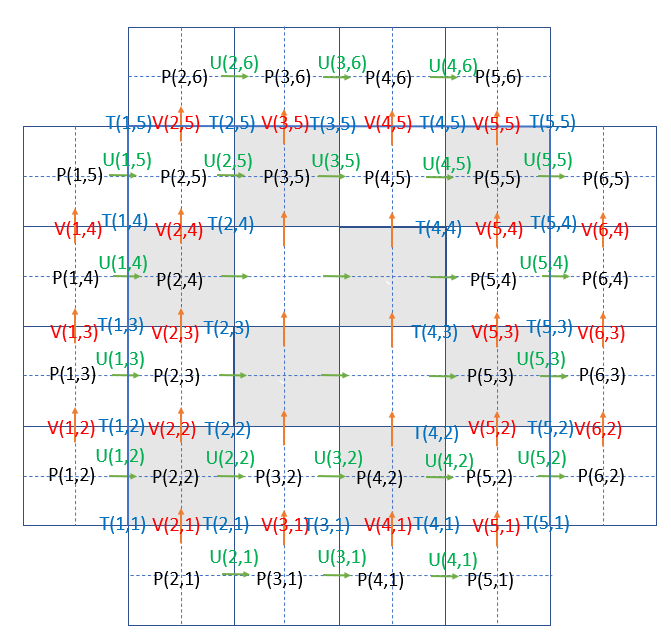
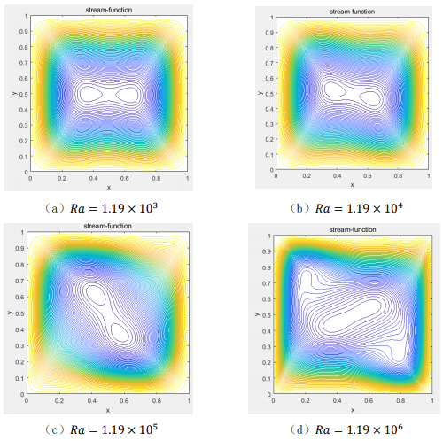
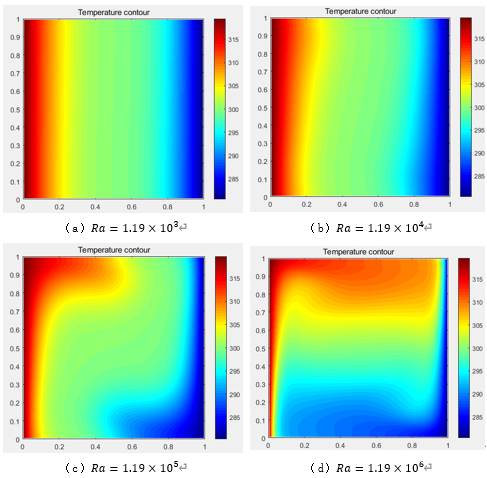

# Closed Cavity Heat Transmission Numerical Calculation

given a cavity whose upper and lower boundaries are adiabatic, left and right boundaries are isothermal with temperature differences.

# Usage

 - SimpleBox.m for demo
 - plotdata.m for graph

## meshing diagram

## Demo Result
### temperature distribution with different Ra

### stream functions with different Ra

# References

* [CFD](https://github.com/haloless/StupidCFD)

# Books

* 王福军. 计算流体动力学分析. 清华大学出版社
* 杨世铭,陶文铨. 传热学.4版. 高等教育出版社
